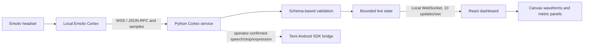

# BrainWaves / BrainBot

A local dashboard for the Emotiv EPOC X EEG headset. The Python backend connects to the Emotiv Cortex service on your computer; the React dashboard shows genuine samples and clearly reports when hardware, credentials, or licensed streams are unavailable.

The wider BrainBot project explores brain–robot interaction with Temi. This version provides participant baseline/assessment workflows, labelled heuristic estimates, profile training, optional consent-gated recording/replay/filtering, and a Temi Android bridge source project. Mental commands are displayed, but do not automatically move the robot.

## Branch integration

The dashboard remains from `hamzacode`. Hardware clients from `main` (`26022de`) are retained in `backend/legacy` and preserved. Cortex uses the connection client through its single-owner adapter; Temi uses the documented v1 bridge contract directly. Cortex retains the dashboard adapter's single socket reader, request matching, stream parsing, and retry logic. Small changes to the original clients allow connection timeouts, certificate configuration, and authenticated bridge URLs. The simulated BrainBot demo is not launched.

The dashboard shows independent backend, Cortex API, headset, and Temi robot connection cards. The Temi bridge must expose `GET /api/status` with a boolean `robot_connected` based on its actual SDK connection; checks run every five seconds. See [bridge contract](docs/temi-bridge.md).

## Operator documentation

- [Session operation, profile/training and configuration](docs/operator-guide.md)
- [Estimated-state formulas, thresholds and evaluation](docs/estimated-state.md)
- [Recording, replay, causal filtering and future LSL boundary](docs/recording.md)
- [Android Temi bridge contract and installation](docs/temi-bridge.md)
- [Checks and hardware acceptance](docs/verification.md)

Optional filter installation: `python -m pip install -r requirements-filter.txt`. All Python requirements use the checked-in exact transitive `constraints.txt`; update pins deliberately and rerun the checks. GitHub Actions runs typecheck, ESLint/Ruff, frontend/backend tests including optional filtering, and production build on Python 3.11/3.14 with Node 24. The hosted workflow itself has not run until this branch is pushed by an authorized user.

## Features

- Live individual or all-channel EEG waveforms in microvolts, with configurable 2–30-second windows, pause and scale controls.
- Cortex-provided frequency-band power by channel, when subscribed and licensed.
- Performance metrics with inactive/null values preserved as unavailable.
- Device/contact quality, EEG quality, headset status, and mental-command power.
- Stream subscription failures, sample freshness, observed arrival rates, and malformed-sample counts.
- Automatic Cortex retry and browser reconnect; session changes clear previous participant data.
- Local-only defaults, bounded buffers, and no generated EEG data. Recording is explicitly consent-gated and off by default.

## Technology and architecture

Frontend: React 18, TypeScript, Vite, native WebSocket, and Canvas charts. Backend: Python, FastAPI/Uvicorn, and websocket-client. ESLint, Ruff, Vitest, and Python unittest provide checks. No chart framework is required. SciPy is optional for the causal filtered EEG view.



Cortex is the headset service, not this application's backend. Cortex normally listens at `wss://localhost:6868`. Our backend normally listens at `http://localhost:8000`. The frontend normally runs at `http://localhost:3000`.

## Folder structure

```text
backend/
  __main__.py           Backend startup
  app.py                HTTP routes and browser WebSocket
  config.py             Environment validation
  data.py               Cortex columns and sample interpretation
  state.py              Bounded, thread-safe live state
  services/
    cortex.py           Real connection, authentication, session, subscription, retry
    temi.py             Optional real speech/stop bridge client
  tests/                Hardware-independent protocol and transport tests
src/
  App.tsx               Dashboard composition
  main.tsx              Browser entry point
  components/dashboard/ Waveforms, metrics, quality, bands, stream status
  hooks/useDashboard.ts Browser connection and reconnect lifecycle
  services/             API URL, payload validation, bounded history
  types/                Shared frontend data interfaces
  styles/               Design tokens and responsive CSS
scripts/                Setup and local process launchers
docs/                   Stream details and robot bridge contract
.env.example            All supported settings, without secrets
requirements*.txt       Python runtime and development dependencies
package*.json           Frontend dependencies and lockfile
```

## Prerequisites

- Python 3.11 or later and Node.js 22.12 or later. Node 24 LTS is recommended.
- npm (included with Node).
- For real data: an EPOC X, compatible connection hardware, installed Emotiv Launcher/Cortex, an Emotiv account, and registered Cortex app credentials.
- License access for the streams you want to display. Raw EEG requires paid access. Installing this application does not grant a license.
- A modern browser supporting Canvas, WebSocket, and ResizeObserver.

Hardware is optional for starting the application: without credentials or a connected headset it runs with explicit waiting states and empty charts.

## Installation

Clone this repository, then change into its project directory (the directory containing `package.json`):

```bash
cd BrainWaves-Project
python3 -m venv .venv
source .venv/bin/activate
python -m pip install -r requirements-dev.txt
npm ci
cp .env.example .env
```

On Windows, use `py -m venv .venv`, then `.venv\Scripts\Activate.ps1` in PowerShell. The npm backend launcher selects the Windows Python executable automatically. On macOS/Linux, `bash scripts/setup.sh` also installs dependencies and copies `.env.example` only when `.env` does not exist.

Edit `.env` and enter your Emotiv app's client ID and secret. Never put credentials in a `VITE_` setting: those settings are bundled into the browser. `.env` is ignored by Git. Configuration has moved from the old `config/settings.yaml` to `.env`; the old placeholder EEG/mood/interaction settings were unused and removed.

## Environment variables

| Variable | Default / purpose |
|---|---|
| `EMOTIV_CLIENT_ID` | Required for headset access; backend stays available when blank |
| `EMOTIV_CLIENT_SECRET` | Required for headset access; backend only |
| `CORTEX_URL` | `wss://localhost:6868`; only local WSS hosts accepted |
| `CORTEX_CA_CERT` | Optional trusted Cortex certificate path; blank permits its self-signed local certificate |
| `CORTEX_HEADSET_ID` | Optional exact headset ID; blank chooses the first connected headset |
| `CORTEX_STREAMS` | `com,met,dev,eq,sys`; comma-separated streams |
| `CORTEX_ACTIVATE_SESSION` | `false`; set `true` for licensed raw EEG/high-resolution metrics; may debit session quota |
| `CORTEX_REQUEST_TIMEOUT` | `10` seconds per protocol request |
| `CORTEX_RECONNECT_SECONDS` | `5` seconds between connection attempts |
| `BACKEND_HOST` | `127.0.0.1` |
| `BACKEND_PORT` | `8000` |
| `FRONTEND_PORT` | `3000`; development and preview server |
| `FRONTEND_ORIGIN` | `http://localhost:3000`; allowed browser origin |
| `VITE_API_BASE_URL` | `http://localhost:8000`; browser backend base URL |
| `TEMI_BRIDGE_URL` | Optional base URL including `/api`; no bridge assumed |
| `TEMI_BRIDGE_TOKEN` | Optional bearer token for your bridge |

If changing ports, update the frontend origin and API base URL together as appropriate. Restart services after editing `.env`. Open the frontend using the exact allowed origin, including hostname and port (`localhost` and `127.0.0.1` are different browser origins).

## Run locally

Start both services from the project root:

```bash
npm run dev
```

Open **http://localhost:3000**. Ctrl+C stops both services. A missing Python environment produces setup instructions; port conflicts are reported by the server that cannot start.

Or use two terminals:

```bash
# Terminal 1
npm run dev:backend
# Equivalent with an activated Python environment: python -m backend

# Terminal 2
npm run dev:frontend
```

Build and serve the frontend locally:

```bash
npm run build
npm run preview
```

The backend must also be running for live data. Preview uses the same frontend port/origin; stop the Vite development server first. API documentation is available at **http://localhost:8000/docs**.

## Headset setup

1. Install/open Emotiv Launcher, log into the intended account, and ensure local Cortex is running.
2. Charge, prepare, fit, and pair the headset according to Emotiv's instructions. Check electrode contact in the vendor's tools before relying on measurements.
3. Register a Cortex app and copy its credentials into `.env`.
4. Start the application and approve access in Launcher when requested. The backend retries while waiting for access or the headset.
5. For waveforms, set `CORTEX_ACTIVATE_SESSION=true` and add `eeg` to `CORTEX_STREAMS` if your license permits it. For Cortex band-power data, add `pow` if permitted. Example: `com,met,dev,eq,sys,eeg,pow`.
6. Restart the backend after changing stream configuration. Denied streams appear individually; successful streams can still display data.
7. To use mental commands, load an EPOC-compatible participant profile and train neutral then one action using the dashboard or EmotivBCI. Use dashboard profile/training controls; see the operator guide.

## How data reaches the dashboard

The backend opens one Cortex socket and performs `requestAccess`, `queryHeadsets`, `authorize`, `createSession`, and `subscribe`. Default sessions are opened without activating a paid license. With `CORTEX_ACTIVATE_SESSION=true`, authorization debits one session and creates an activated session; this can consume quota on licenses with session limits. Its single socket owner matches JSON-RPC replies by request ID and buffers interleaved notifications. Subscription results provide the `cols` labels for each stream; these labels determine what each array value means.

Samples include a session ID and a Unix timestamp in seconds. The parser validates the timestamp and structure, expands nested device-quality labels, extracts EEG sensor amplitudes, and respects metric `.isActive` flags. Samples from old sessions and invalid EEG are not plotted. Metadata such as markers and counters is not mistaken for a sensor channel.

Live state stores the latest sample per stream, up to 256 raw/filtered EEG samples and 2,048 metric samples. Every 100 ms, `/api/live` sends metadata and incremental EEG/metric batches using sequence cursors; the first message is a bounded snapshot. Slow consumers receive explicit EEG gap counts instead of an unbounded queue. The browser retains at most 30 seconds / 16,384 EEG samples and 300 seconds / 2,048 metric samples. Duplicate and out-of-order timestamps are rejected and counted. Participant epochs clear browser history independently of Cortex sessions. Optional recording writes valid samples on the backend acquisition path before visualization eviction.

## Understanding the dashboard

- **Waveforms:** genuine raw sensor amplitude in µV, or an explicitly labelled optional causal filtered view. Choose automatic/fixed/common scale. Gaps over 100 ms break the line. Cortex interpolation flags are counted, and last-sample age identifies frozen/stale data. Choose one channel or show all received channels.
- **Band power:** Cortex's `pow` values in µV²/Hz for theta, alpha, low/high beta, and gamma. The application does not calculate Delta or derive bands from raw EEG.
- **Performance metrics:** vendor estimates such as engagement and relaxation. Inactive/null entries remain unavailable. Timestamped vendor trends are separate from the explicitly labelled application Estimated state.
- **Quality:** `dev` contact quality and `eq` EEG quality are shown separately, using received labels. Channel quality is 0–4; overall quality is 0–100. Battery fields retain their original scale.
- **Availability:** requested-but-denied streams differ from streams not requested, and subscribed streams waiting for their first sample. Observed rates are based on backend arrivals over a short window; low-frequency streams may show no rate estimate.
- **Connection:** the frontend detects closed and silent connections and reconnects. The backend checks headset presence about every five seconds and retries after failures. A new session clears old traces and metric values.

## Checks

```bash
npm run typecheck
npm run lint
npm test
npm run build
```

`npm test` runs frontend payload/history tests and backend parser, protocol, state, HTTP, and WebSocket tests. Fixtures exist only in tests; runtime code never generates EEG samples. The original connectivity scripts were interactive hardware demos, not an automated test suite, and have been replaced with these tests.

See [verification notes](docs/verification.md) for the exact checks performed in this refactor and the hardware testing boundary.

## Troubleshooting

| Symptom | What to check |
|---|---|
| Backend unavailable | Start the backend, inspect its terminal, verify `VITE_API_BASE_URL` and the port |
| Waiting for credentials | Fill the two Emotiv credential variables and restart backend |
| Cannot communicate with Cortex | Open Launcher, check login/Cortex service, local URL, and certificate settings |
| Approve access message | Grant app access in Launcher, then wait for retry |
| Waiting for headset | Pair/power on the device; verify optional `CORTEX_HEADSET_ID` |
| Raw EEG unavailable | Add `eeg`, verify paid license access, restart; read the rejection message |
| Metrics unavailable | Poor signal, inactive detection, license denial, or no sample yet; check quality and freshness |
| Invalid sample count increases | The received values do not match subscription columns; investigate the Cortex version/payload without replacing values with fake numbers |
| WebSocket immediately closes | Open the exact `FRONTEND_ORIGIN`; inspect browser network errors |
| Port already in use | Stop the old server or change matching `.env` settings |
| Missing .venv | Follow installation instructions before using npm launch commands |
| Temi endpoint returns 503 | No compatible bridge configured; see bridge documentation |

## Development notes and limitations

Keep hardware I/O in `backend/services`, data interpretation in `backend/data.py`, and presentation in dashboard components. Update frontend types and payload validation when changing the WebSocket contract. Avoid performing socket reads from multiple threads. Buffers must stay bounded.

No physical headset or robot was used to validate this refactor. Account/license eligibility, electrode preparation, real sampling rate, participant training, and firmware compatibility still require hardware testing. Default stream access is not guaranteed; the subscription response is authoritative. The current channel extraction covers EPOC X and common Emotiv sensor names, not arbitrary custom Flex sensor mappings.

Participant operation, profile/training, estimated-state formulas and limitations, recording/replay/filtering and hardware acceptance are documented below. The single-headset workflow is local and operator-controlled. Estimates are unvalidated heuristic scores, not probabilities, validated confidence or medical diagnoses. Automatic robot movement remains disabled.

Temi speech, cancellation and on-screen expression require building/installing the supplied Android bridge. Android build/tooling and physical firmware/SDK behavior remain hardware-dependent checks. An SDK stop request is not a verified emergency-stop mechanism.

Official protocol references and stream formats are documented in [Cortex integration](docs/research.md).
